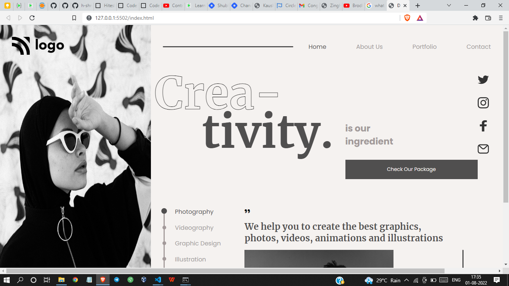

# Project 14 - HTML  and CSS 

By Shreesha

Here's the Live Deployed Website of 

## Project 14  [DEPLOYED LINK](https://project14-dance-home-page.netlify.app/)

# What did I learn in this project

- I got to learn about the positioning of containers. 
- Got to learn about the flexbox.
- The website is also responsive.

## Time taken to complete project is 5.5 hours
